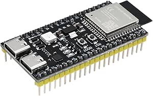

# Project Hardware Decision: ESP32-S3

For our atmospheric and space weather research project, we have decided to use the **ESP32-S3** microcontroller as the core component for data processing and storage. Below, we outline the key benefits of the ESP32-S3 and why it’s an ideal fit for our project’s requirements.

## Why ESP32-S3?

The **ESP32-S3** offers several advantages that align with our project's goals of accurate data collection, energy efficiency, and expandability. The following points highlight why this microcontroller is well-suited for our needs:

### 1. **Dual-Core Processor and Enhanced Performance**

   - The **ESP32-S3** features a **dual-core Xtensa LX7 processor** running at up to 240 MHz, allowing it to handle multiple sensor inputs and data processing tasks simultaneously.
   - With increased performance and processing power, we can ensure smoother and more accurate real-time data logging, especially useful when managing a high volume of atmospheric and environmental data.

### 2. **Energy Efficiency**

   - **Low-power modes** allow the ESP32-S3 to reduce energy consumption during data collection, extending battery life—essential for extended flights or remote sensing projects.
   - Efficient power management aligns with our plans to be able to use a solar power system, enabling prolonged deployment and continuous data capture without frequent battery replacements.

### 3. **Built-in Wi-Fi and Bluetooth 5.0**

   - The **integrated Wi-Fi** capability supports wireless data retrieval when the device is within range, which can be especially useful for quick data offloading during field tests.
   - **Bluetooth 5.0** adds the option for short-range communication and data synchronization, increasing the flexibility for future expansion with additional Bluetooth-enabled sensors or devices.

### 4. **Increased Memory and I/O Capabilities**

   - With **more GPIO pins** and **upgraded memory** compared to other ESP models, the ESP32-S3 can support a larger array of sensors.
   - The **higher RAM** capacity enhances data buffering capabilities, allowing us to store data locally until we retrieve it, without risk of data loss.

### 5. **Enhanced AI and ML Capabilities**

   - The ESP32-S3 includes **vector instructions for machine learning** and AI processing, which opens up future possibilities for on-device data analysis and pattern recognition, adding scientific depth to our atmospheric measurements.

### 6. **Cost-Effective Solution**

   - The ESP32-S3 offers a strong balance between performance and cost, providing all the necessary features without exceeding our budget. This cost-effectiveness allows us to allocate more resources towards advanced sensors and storage modules.

## Summary

The **ESP32-S3** combines performance, energy efficiency, and scalability, making it the ideal choice for our project. Its capabilities will not only allow us to capture a wide range of environmental data but also offer the potential for future upgrades as our project evolves. By using the ESP32-S3, we ensure a robust, adaptable, and efficient solution for high-quality atmospheric and space weather data collection.
