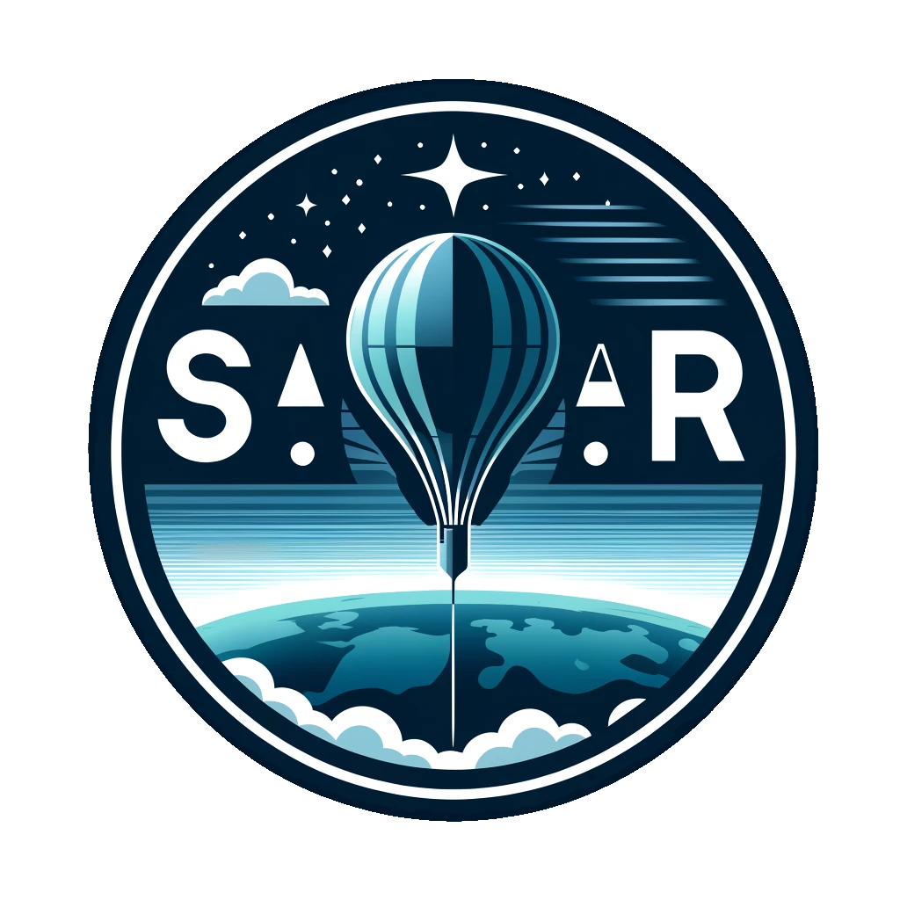

<h1 align="center">S.T.A.R. - Stratospheric Technology for Atmospheric Research</h1>

   
   
   
   
   
   

   
   
   

   
   
   
   
   
   
   
   
   
   
   

## Overview

The **S.T.A.R.** Project is an innovative high-altitude balloon (HAB) mission dedicated to observing and analyzing atmospheric and space weather.
By deploying sensors to gather data at the edge of space, this project aims to expand our understanding of the effects of solar and cosmic activity on Earth’s atmosphere.
These insights could help advance predictions for space weather events and their impact on technologies reliant on atmospheric stability, including GPS systems, communication satellites, and power grids.

## Project Goals

1. **Data Collection** – Deploy a high-altitude balloon equipped with specialized sensors to measure atmospheric and space weather parameters, such as radiation levels, temperature, UV radiation, magnetic field variations, and humidity.
2. **Space Weather Analysis** – Investigate correlations between atmospheric data and solar activities, such as solar flares, to gain a better understanding of how space weather events influence the stratosphere and technology on Earth.
3. **Educational and Scientific Contribution** – Provide a platform for technical learning and collaboration, and share findings with the scientific community to support further research.

## Project Scope

The project will be conducted in three phases, each with its distinct focus:

### Hardware Development

* Design and configure the HAB structure with robust, lightweight materials.
* Select and integrate sensors for environmental monitoring (UV, temperature, magnetic field, etc.).
* Develop a payload system including data logging, data transmission, and power supply for high-altitude operation.

### Tech Infrastructure

* Establish data transmission and reception capabilities, potentially using LoRa or GSM modules, to enable real-time data telemetry.
* Set up a cloud database to store incoming data and automate backups for secure storage and retrieval.
* Implement a Grafana dashboard to visualize and monitor real-time data, enabling immediate analysis during flight.

### Software and Programming

* Develop scripts for processing and analyzing collected data to identify trends and anomalies.
* Automate data cleansing and visualization in Python, using frameworks like Pandas and Matplotlib.
* Develop a web interface for data sharing and research collaboration, allowing external researchers and the public to access key findings.

## Technical Requirements

1. Hardware
   * Balloon and Recovery System – High-durability balloon with helium inflation, and a parachute system for controlled descent.
   * Sensor Suite – Integration of environmental sensors:
     * UV sensor
     * Magnetometer
     * Temperature, pressure, and humidity sensors
     * Radiation detector
     * GPS module
   * Data Logger and Processor – Raspberry Pi or Arduino for sensor data logging and basic processing.
2. Infrastructure
   * Communication – LoRa or GSM module for real-time data transmission.
   * Cloud Services – Set up a database (e.g., AWS, Firebase) for data storage and integration with Grafana for real-time monitoring.
   * Data Backup – Automated, secure data backups for redundancy.
3. Software Stack
   * Python for data processing, visualization, and analysis.
   * Grafana for dashboarding and real-time data insights.
   * Flask/Django for any web-based interfaces.
   * GitHub for project management, version control, and documentation (Documentation-As-Code).

## Workflow and Project Timeline

1. Phase 1: Research and Planning
   * Sensor selection and hardware procurement.
   * Design system architecture for data logging, transmission, and storage.
   * Initial project planning and budgeting.
2. Phase 2: Prototyping and Testing
   * Assemble a basic prototype of the payload.
   * Conduct low-altitude test flights to assess sensor performance and communication reliability.
   * Review and adjust sensor integration, data logging, and transmission systems.
3. Phase 3: Full Deployment
   * Conduct high-altitude launch with all integrated systems.
   * Monitor and collect data in real-time via the Grafana dashboard.
   * Retrieve payload post-landing and perform data analysis.
4. Phase 4: Data Analysis and Publication
   * Cleanse and process the collected data.
   * Analyze data patterns for correlations with space weather events.
   * Publish findings and share data for educational and research purposes.

## Potential Impact

The S.T.A.R. project offers substantial contributions to scientific understanding and public awareness of space weather and atmospheric changes.
The data collected will aid in developing predictive models for space weather impacts on Earth and offer educational opportunities in scientific methods and technology.

## Roles and Responsibilities

The project team consists of two core members, xKabbe and blckfox, each bringing unique expertise to the table:

**xKabbe:**

An experienced programmer with extensive knowledge of Python and other programming languages as well as data visualization.
xKabbe is responsible for developing the software that will handle data processing from sensors and visualization.
This ensures that data is effectively visualized and easily interpretable for analysis.

**blckfox:**

Specializes in IT infrastructure and data systems, with a strong focus on the hardware part, data collection, and microcontrollers as well as sensors.
blckfox is in charge of setting up and maintaining the technical foundation of the measuring systems, making sure that all data collecting and storage solutions are robust and efficient.

Together, our team covers both the hardware and software aspects of the project, providing a comprehensive approach to each stage, from design and development to deployment and analysis.